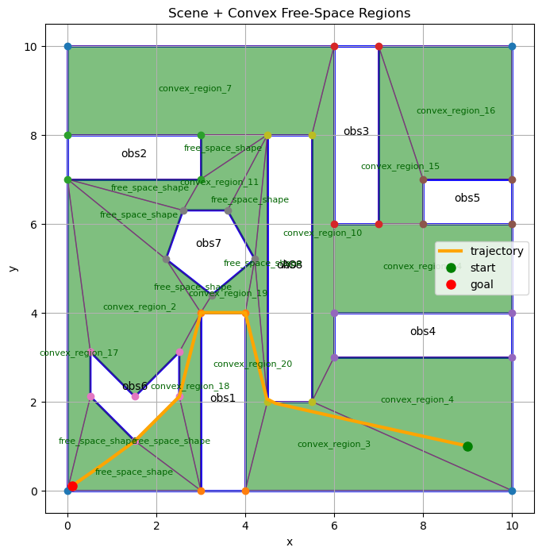
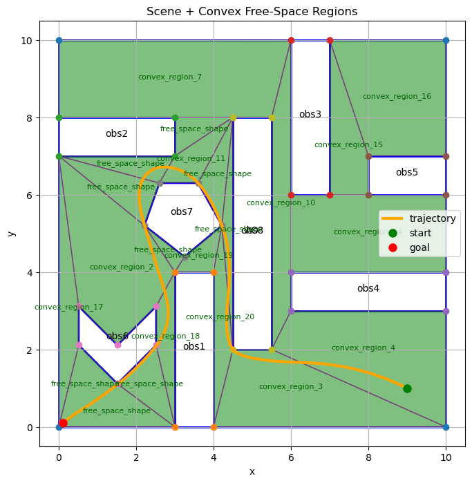
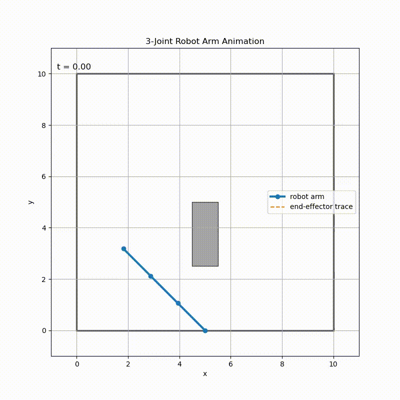

# GCS_Planning_Project
Trevor Stack's final project for 24786 Advanced Optimization S26

Presentation slides are [HERE](https://docs.google.com/presentation/d/1eEx23Pf4ArSnRoN660epyI2_gxAgnMcG-5Q4rHJfaCc/edit?usp=sharing)
## Instructions to Build and Run Code

### Install Dependencies

1. Build and install CGAL [HERE](https://github.com/cgal/cgal). I installed version 6.0.1

2. OPTIONAL: Install MOSEK [HERE](https://www.mosek.com/) using your academic license
   
3. OPTIONAL: Install Gurobi [HERE](https://www.gurobi.com/?utm_source=google&utm_medium=cpc&utm_campaign=2026+na+googleads+search+brand&utm_content=dmwg&gad_source=1&gad_campaignid=193283256&gclid=CjwKCAjwqazPBhALEiwAOuXqdHG2FsBweUvRhB3BVCCx5JPb7XGrXVd7GF9r_a_St8DhDv7ZXagWOBoCMIAQAvD_BwE) using your academic license
   
4. Build and install Drake from source [HERE](https://github.com/RobotLocomotion/drake). Follow [these instructions](https://drake.mit.edu/from_source.html). If you followed steps 2 and/or 3, configure the CMAKE options to enable the use of the Gurobi and MOSEK solvers.

### Build the Code
```
git clone https://github.com/Trevor-Stack/GCS_Planning_Project.git
cd GCS_Planning_Project
mkdir build
cd build
cmake ..
make -j$(nproc)
```

### Run the Code
From the `build` directory, run this for the point robot problem 
```
./gcs_planner ../configs/gcs_config1.json
```

From the `build` directory, run this for the robot arm problem 
```
./gcs_planner ../configs/gcs_config4.json
```

### Viewing the Results
All results will be recorded in the `results` folder. Please see `results/map_vis.ipynb` for code to visualize the trajectory and/or produce videos.

### Tuning Parameters and Editing Maps
All parameters can be tuned in the json files within the `configs` folder

Maps can be customized by editing the jsons in the `maps` folder

## Visualizations
### Point Robot Non-smooth


### Point Robot Smooth


### Robot Arm Non-smooth


### Robot Arm Smooth
